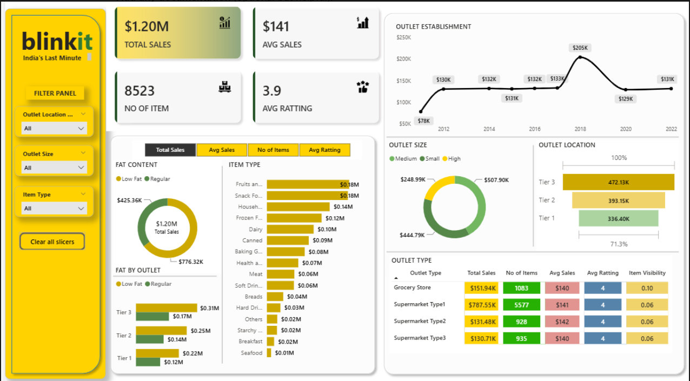

# 📊 Blinkit Sales Dashboard – Power BI Report

## 🚀 Overview
This Power BI dashboard provides a comprehensive analysis of **Blinkit's** sales performance across different outlets and product types.  
It helps uncover trends in **total sales, average sales, item types, outlet size/location**, and **customer ratings**.

---

## 📁 Features

- 📈 **KPIs**: Total Sales, Avg Sales, Total Items, Avg Rating
- 🏪 **Outlet Analysis**:
  - Sales by Outlet Location (Tier 1, 2, 3)
  - Size-wise Distribution (Small, Medium, High)
  - Establishment Trend (2012–2022)
- 🥦 **Product Insights**:
  - Sales by Item Type & Fat Content
  - Ratings & Items Breakdown
- 🔍 **Visual Filters**:
  - Outlet Location
  - Outlet Size
  - Item Type

---

## 🧠 Key Insights

- **Tier 3 outlets** have the highest sales (~$472K) — strong presence in developing areas.
- **Supermarket Type 1** drives the largest share of sales and item count.
- **Low Fat products** contribute ~$425K — indicating health-conscious customer behavior.
- **Peak year of outlet establishment**: 2018 ($205K).

---

## 📂 Project Files

| File | Description |
|------|-------------|
| `Blinkit_Sales_Report.pbix` | Main Power BI dashboard file |
| `README.md` | This documentation |
| *(Optional)* `Blinkit_Sales_Data.xlsx` | Underlying raw dataset (if included) |

---

## 🛠️ Tools & Tech Used

- Microsoft Power BI
- Power Query Editor
- DAX (Data Analysis Expressions)
- Data Modeling
- UX/UI design (custom visuals, slicers)

---

## ✨ Future Enhancements

- 📅 Add Date Slicers (Month/Quarter)
- 📊 Drill-through to outlet-level or item-level pages
- 📎 Add Tooltips with deeper insights
- 🧠 Add AI-based Forecasting or Clustering (RFM, K-Means)
- 📘 Add a separate **Story/Narrative Page** to walk users through insights

---

## 📸 Preview

  
*You can replace this with your hosted image URL or local file path*

---

## 🙌 Connect with Me

- **LinkedIn**: [Harshil Shah](https://www.linkedin.com/in/your-profile)
- **GitHub**: [HarshilCoder](https://github.com/HarshilCoder)
- **Portfolio**: [harshilcoder.github.io](https://harshilcoder.github.io/)

---

